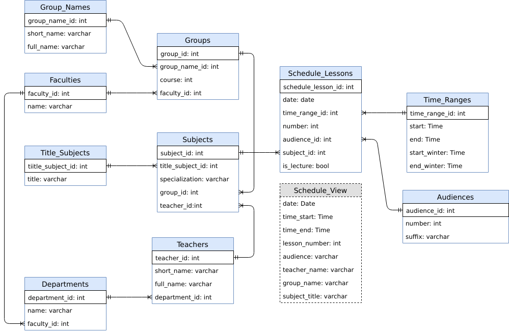
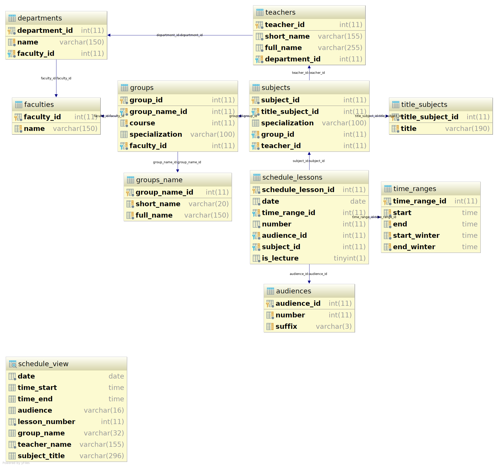

# ScheduleDB
It's a simple repo that contains ER diagram with some samples of SQL queries for university schedule database

All files => [archive](IvankivR_Schedule.zip)

PDF => [link](https://drive.google.com/open?id=1FU6Q3LKSXu1YszV9zqY7aQuHixHiywIZ)

DOC => [link](https://drive.google.com/open?id=1sO-Jhg0fiiRGXu-GXMMf9aoCY9hWDwzdCe8UhmJma1U)
### Entity Relationship(ER) diagram
<!---->


You can check the last ER file state by using the link:
https://drive.google.com/open?id=1aDWQL211f57FJm77-aUXAawMP3MDmlwY

### And after creating a DB we have the next database structure


### Tools
* Linux 4.19.4-arch1-1-[ARCH](https://www.archlinux.org/)
* [MySQL](https://wiki.archlinux.org/index.php/MySQL_(%D0%A0%D1%83%D1%81%D1%81%D0%BA%D0%B8%D0%B9)) Ver 15.1 Distrib 10.1.37-MariaDB, for Linux (x86_64)
* [IntelliJ IDEA](https://www.jetbrains.com/idea/) 2018.2.6 (Ultimate Edition)
* For creating ER diagram [Draw.io](https://www.draw.io/)

### Examples of SQL queries
###### 1. Select all faculties in university
```sql
select *
from faculties f
order by f.faculty_id;
```

| faculty_id | name |
|---|---|
| 1	 | Економічний факультет |
| 2	 | Педагогічний факультет |
| 3	 | Факультет іноземних мов |
| 4	 | Філософський факультет |
| 5	 | Факультет математики та інформатики |
| 6	 | Факультет філології |
| 7	 | Факультет туризму |
| 8	 | Фізико-технічний факультет |
| 9	 | Факультет історії, політології і міжнародних відносин |
| 10 | Факультет природничих наук |
| 11 | Факультет фізичного виховання і спорту |

###### 2. Select all departments with faculty name
```sql
select f.name as `faculty` , d.name as `department`
from departments d
       join faculties f using (faculty_id);
```
| faculty | department |
|---|---|
| Факультет математики та інформатики | Кафедра диференціальних рівнянь і прикладної математики |
| Факультет математики та інформатики | Кафедра математичного і функціонального аналізу |
| Факультет математики та інформатики | Кафедра комп’ютерних наук та інформаційних систем |
| Факультет математики та інформатики | Кафедра алгебри та геометрії |
| Факультет математики та інформатики | Кафедра інформаційних технологій |
| Факультет математики та інформатики | Кафедра статистики і вищої математики |
| Фізико-технічний факультет | Кафедра комп’ютерної інженерії та електроніки |
| Фізико-технічний факультет | Кафедра теоретичної та експериментальної фізики |
| Фізико-технічний факультет | Кафедра матеріалознавства і новітніх технологій |
| Фізико-технічний факультет | Кафедра фізики і хімії твердого тіла |

###### 3. Select name of all departments that relate to faculty with name 'Факультет математики та інформатики'
```sql
select d.name as `department`
from departments d
       join faculties f using (faculty_id)
where f.name = 'Факультет математики та інформатики';
```

|  department |
|---|
| Кафедра диференціальних рівнянь і прикладної математики |
| Кафедра математичного і функціонального аналізу |
| Кафедра комп’ютерних наук та інформаційних систем |
| Кафедра алгебри та геометрії |
| Кафедра інформаційних технологій |
| Кафедра статистики і вищої математики |


###### 4. Select faculty, department, short and full name of all the teachers who have name 'Ігор'
```sql
select f.name `faculty`, d.name `department`, t.short_name, t.full_name
from teachers t
       join departments d using (department_id)
       join faculties f using (faculty_id)
where t.full_name like '% Ігор %'
  and f.name = 'Факультет математики та інформатики';
```

| faculty  | department  | short_name  | full_name  |
|---|---|---|---|
| Факультет математики та інформатики | Кафедра інформаційних технологій | Лазарович І.М. | Лазарович Ігор Миколайович |

###### 5. Select all groups with their names and faculties
```sql
select concat(gn.short_name, '-', g.course) `group`,
       gn.full_name,
       f.name `faculty`
from groups g
       join groups_name gn using (group_name_id)
       join faculties f using (faculty_id);
```
| group | full_name | faculty |
| --- | ---| --- |
| ІПЗ-1 | Інженерія програмного забезпечення | Факультет математики та інформатики |
| ІПЗ-2 | Інженерія програмного забезпечення | Факультет математики та інформатики |
| ІПЗ-3 | Інженерія програмного забезпечення | Факультет математики та інформатики |
| КН-1 | Комп’ютерні науки | Факультет математики та інформатики |
| КН-2 | Комп’ютерні науки | Факультет математики та інформатики |
| ОП-1 | Облік і оподаткування | Економічний факультет |
| ЕК-2 | Економічна кібернетика | Економічний факультет |
| ПІ-4 | Програмна інженерія | Факультет математики та інформатики |

###### 6. Select all subjects for group `ПІ-4`, return columns (subject, group, teacher)
```sql
select t.title `subject`,
       concat(gn.short_name, '-', g.course, ifnull(concat('(', s.specialization, ')'), '')) `group`,
       tch.short_name `teacher`
from subjects s
       join title_subjects t using (title_subject_id)
       join groups g using (group_id)
       join groups_name gn using (group_name_id)
       join teachers tch using (teacher_id)
where gn.short_name = 'ПІ' and g.course = 4;
```
| subject | group | teacher |
| --- | --- | --- |
| Програмування на frameworks Python | ПІ-4(веб.) | Козленко М.І. |
| Програмування для ОС Android | ПІ-4(моб.) | Яновський Ю.М. |
| Професійна практика програмної інженерії | ПІ-4 | Кузь М.В. |
| Стандартизація програмного забезпечення | ПІ-4 | Кузь М.В. |
| Теорія управління | ПІ-4 | Козленко М.І. |
| Інтелектуальний аналіз даних | ПІ-4 | Лазарович І.М. |

###### 7. Select all audiences as one row separated by comma
```sql
select group_concat(concat(a.number, IFNULL(a.suffix, '')) separator ', ') as `audiences`
from audiences a
group by 'all'
order by audience_id;
```
| audiences |
| --- |
| 207, 303, 306, 307, 307a, 308, 309, 310, 314, 318, 320, 320a, 320b, 322, 325 |

###### 8. Select formatted (date, time, audience, group, teacher, subject) lessons for group `ПІ-4` on date `12.12.2018`
```sql
select date_format(l.date, '%d %M %Y')                          as `date`,
       concat(l.number, ')', dayname(l.date), '(',
              time_format(tr.start_winter, '%H:%i'), '-',
              time_format(tr.end_winter, '%H:%i'),
              ')')                                              as `time`,
       concat(a.number, IFNULL(concat('(', a.suffix, ')'), '')) as `audience`,
       concat(gn.short_name, '-', gr.course)                    as `group`,
       tch.short_name                                           as `teacher`,
       concat(ts.title, '(', IF(l.is_lecture, 'Л', 'П'), ') ',
              IFNULL(concat('(', s.specialization, ')'), ''))   as `subject`
from schedule_lessons l
       join time_ranges tr using (time_range_id)
       join audiences a using (audience_id)
       join subjects s using (subject_id)
       join title_subjects ts using (title_subject_id)
       join groups gr using (group_id)
       join teachers tch using (teacher_id)
       join groups_name gn using (group_name_id)
where date = '2018-12-12'
having `group` = 'ПІ-4'
order by l.date, tr.start;
```

| date | time | audience | group | teacher | subject |
| --- | --- | --- | --- | --- | --- |
| 12 December 2018 | 1)Wednesday(09:00-10:20) | 320 | ПІ-4 | Козленко М.І. | Програмування на frameworks Python(Л) (веб.) |
| 12 December 2018 | 2)Wednesday(10:30-11:50) | 320(a) | ПІ-4 | Козленко М.І. | Програмування на frameworks Python(П) (веб.) |
| 12 December 2018 | 4)Wednesday(13:50-15:10) | 318 | ПІ-4 | Кузь М.В. | Професійна практика програмної інженерії(Л)  |
| 12 December 2018 | 5)Wednesday(15:25-16:45) | 307(a) | ПІ-4 | Кузь М.В. | Професійна практика програмної інженерії(П)  |

###### 9. Select all subjects that divided by specialization
```sql
select concat(gn.short_name, '-', g.course) `group`,
       tch.short_name `teacher`,
       ts.title `subject`,
       s.specialization
from subjects s
       join groups g using (group_id)
       join teachers tch using (teacher_id)
       join groups_name gn using (group_name_id)
       join title_subjects ts using (title_subject_id)
where s.specialization is not null
having `group` = 'ПІ-4';
```

| group | teacher | subject | specialization |
| --- | --- | --- | --- |
| ПІ-4 | Козленко М.І. | Програмування на frameworks Python | веб. |
| ПІ-4 | Яновський Ю.М. | Програмування для ОС Android | моб. |

###### 10. Create function for checking is it a winter period time or isn't?
```sql
create or replace function IS_WINTER_PERIOD(date date)
  returns bool
reads sql data
  return (select date
                     between
                     str_to_date(concat('31-10-', year(current_date)), '%d-%m-%Y')
                     and
                     str_to_date(concat('26-03-', year(current_date) + 1), '%d-%m-%Y'));
```

```sql
select IS_WINTER_PERIOD('2019-01-01'); # TRUE
select IS_WINTER_PERIOD('2018-09-01'); # FALSE
```

###### 11. Create function for getting formatted time range
```sql
create or replace function CONCAT_TIME_RANGES(time_start time, time_end time)
  returns varchar(100)
reads sql data
  return (select concat(time_format(time_start, '%H:%i'), ' - ', time_format(time_end, '%H:%i')));
```

```sql
select CONCAT_TIME_RANGES('12:10:00', '14:00:00'); # 12:10 - 14:00
```

```sql
select CONCAT_TIME_RANGES(tr.start, tr.end)
from time_ranges tr
limit 1; # 8:30 - 9:50
```

###### 12. Create view for schedule_lessons table
```sql
create or replace view `schedule_view` as
  select date                                                     as `date`,
         IF(IS_WINTER_PERIOD(l.date), tr.start_winter, tr.start)  as `time_start`,
         IF(IS_WINTER_PERIOD(l.date), tr.end_winter, tr.end)      as `time_end`,
         concat(a.number, IFNULL(concat('(', a.suffix, ')'), '')) as `audience`,
         l.number                                                 as `lesson_number`,
         concat(gn.short_name, '-', gr.course)                    as `group_name`,
         tch.short_name                                           as `teacher_name`,
         concat(ts.title, '(', IF(l.is_lecture, 'Л', 'П'), ') ',
                IFNULL(concat('(', s.specialization, ')'), ''))   as `subject_title`
  from schedule_lessons l
         join time_ranges tr using (time_range_id)
         join audiences a using (audience_id)
         join subjects s using (subject_id)
         join title_subjects ts using (title_subject_id)
         join groups gr using (group_id)
         join teachers tch using (teacher_id)
         join groups_name gn using (group_name_id)
  order by l.date, l.number;
```

```sql
select concat(date_format(sv.date, '%d %M %Y'), '(', dayname(sv.date), ')') as `date`,
       concat(sv.lesson_number, ')', CONCAT_TIME_RANGES(sv.time_start, sv.time_end)) as `time`,
       concat(sv.audience, ' ', sv.teacher_name, ' ', sv.subject_title) as `lesson`
from schedule_view sv
where group_name = 'ІПЗ-3';
```

| date | time | lesson |
| --- | ------ | --- |
| 12 November 2018(Monday) | 1)09:00 - 10:20 | 322 Козленко М.І. Програмування мовою Python(Л) (веб.) |
| 12 November 2018(Monday) | 2)10:30 - 11:50 | 322 Козленко М.І. Програмування мовою Python(Л) (веб.) |
| 12 November 2018(Monday) | 3)12:15 - 13:35 | 322 Козленко М.І. Програмування мовою Python(Л) (веб.) |
| 13 November 2018(Tuesday) | 1)09:00 - 10:20 | 306 Лазарович І.М. Програмування мікроконтролерів(П) (моб.) |
| 13 November 2018(Tuesday) | 2)10:30 - 11:50 | 320(a) Лазарович І.М. Програмування мікроконтролерів(П) (моб.) |
| 13 November 2018(Tuesday) | 3)12:15 - 13:35 | 207 Лазарович І.М. Програмування мікроконтролерів(П) (моб.) |
| 14 November 2018(Wednesday) | 1)09:00 - 10:20 | 309 Кузь М.В. Економіка програмного забезпечення(П)  |
| 14 November 2018(Wednesday) | 2)10:30 - 11:50 | 314 Танчук Н.О. Іноземна мова (англійська)(Л)  |
| 14 November 2018(Wednesday) | 3)12:15 - 13:35 | 318 Міщук М.Б. Політологія(П)  |
| 14 November 2018(Wednesday) | 4)13:50 - 15:10 | 325 Кашуба Г.І. Теорія ймовірностей(Л)  |
| 14 November 2018(Wednesday) | 5)15:25 - 16:45 | 320 Козич О.В. Бази даних(П)  |
| 15 November 2018(Thursday) | 1)09:00 - 10:20 | 320 Лазарович І.М. Програмування мікроконтролерів(Л) (моб.) |
| 15 November 2018(Thursday) | 3)12:15 - 13:35 | 310 Кузь М.В. Емпіричні методи програмної інженерії(П)  |
| 15 November 2018(Thursday) | 4)13:50 - 15:10 | 320 Козич О.В. Бази даних(П)  |
| 15 November 2018(Thursday) | 5)15:25 - 16:45 | 320 Козич О.В. Бази даних(Л)  |
| 15 November 2018(Thursday) | 6)16:55 - 18:15 | 320 Козич О.В. Бази даних(Л)  |
| 16 November 2018(Friday) | 1)09:00 - 10:20 | 320 Лазарович І.М. Програмування мікроконтролерів(Л) (моб.) |
| 16 November 2018(Friday) | 2)10:30 - 11:50 | 310 Лазарович І.М. Програмування мікроконтролерів(П) (моб.) |

###### 13. Select lessons between '2018-11-12' and '2018-11-14' for group `ІПЗ-3` and group all row by date using '\n' separator
```sql
select concat(date_format(sv.date, '%d %M %Y'), '(', dayname(sv.date), ')') as `date`,
       group_concat(concat(sv.lesson_number, ')', CONCAT_TIME_RANGES(sv.time_start, sv.time_end))
                    order by sv.date, sv.lesson_number
                    separator '\n')                                         as `time`,
       group_concat(concat(sv.audience, ' ', sv.teacher_name, ' ', sv.subject_title)
                    order by sv.date, sv.lesson_number separator '\n')      as `lessons`
from schedule_view sv
where (sv.date between '2018-11-12' and '2018-11-14') and group_name = 'ІПЗ-3'
group by sv.date;
```

<table border="1" style="border-collapse:collapse">
<tr><th>date</th><th width="250">time</th><th>lessons</th></tr>
<tr><td>12 November 2018(Monday)</td><td>1)09:00 - 10:20<br/>2)10:30 - 11:50<br/>3)12:15 - 13:35</td><td>322 Козленко М.І. Програмування мовою Python(Л) (веб.)<br/>322 Козленко М.І. Програмування мовою Python(Л) (веб.)<br/>322 Козленко М.І. Програмування мовою Python(Л) (веб.)</td></tr>
<tr><td>13 November 2018(Tuesday)</td><td>1)09:00 - 10:20<br/>2)10:30 - 11:50<br/>3)12:15 - 13:35</td><td>306 Лазарович І.М. Програмування мікроконтролерів(П) (моб.)<br/>320(a) Лазарович І.М. Програмування мікроконтролерів(П) (моб.)<br/>207 Лазарович І.М. Програмування мікроконтролерів(П) (моб.)</td></tr>
<tr><td>14 November 2018(Wednesday)</td><td>1)09:00 - 10:20<br/>2)10:30 - 11:50<br/>3)12:15 - 13:35<br/>4)13:50 - 15:10<br/>5)15:25 - 16:45</td><td>309 Кузь М.В. Економіка програмного забезпечення(П) <br/>314 Танчук Н.О. Іноземна мова (англійська)(Л) <br/>318 Міщук М.Б. Політологія(П) <br/>325 Кашуба Г.І. Теорія ймовірностей(Л) <br/>320 Козич О.В. Бази даних(П) </td></tr></table>

###### 14. Create procedure for more comfortable inserting and removing some lessons
```sql
create procedure add_schedule_lesson(
  lesson_date       date,
  lesson_number     int,
  group_name        varchar(20), teacher_name varchar(130),
  audience          varchar(20),
  subject_title     varchar(190), specialization varchar(60),
  lesson_is_lecture bool
)
  begin
    insert into schedule_lessons (date, time_range_id, number, audience_id, subject_id, is_lecture)
    values (lesson_date,
            lesson_number,
            lesson_number,
            (select a.audience_id from audiences a where concat(a.number, ifnull(a.suffix, '')) = audience),
            (select s.subject_id
             from subjects s
                    join title_subjects ts using (title_subject_id)
                    join teachers tch using (teacher_id)
                    join groups g using (group_id)
                    join groups_name gn using (group_name_id)
             where ts.title = subject_title
               and concat(gn.short_name, '-', g.course) = group_name
               and tch.short_name = teacher_name
               and IF((s.specialization is null and s.specialization is null)
                        or (s.specialization = specialization), TRUE, FALSE)),
            lesson_is_lecture);
  end;
```

```sql
create procedure remove_schedule_lesson(
    lesson_date       date,
    lesson_number     int,
    group_name        varchar(20), teacher_name varchar(130),
    audience          varchar(20),
    subject_title     varchar(190), specialization varchar(60),
    lesson_is_lecture bool
  )
    begin
      delete
      from schedule_lessons
      where lesson_date = schedule_lessons.date
        and lesson_number = schedule_lessons.number
        and lesson_number = schedule_lessons.time_range_id
        and audience = (select concat(a.number, ifnull(a.suffix, '')) from audiences a where schedule_lessons.audience_id = a.audience_id)
        and (select ts.title = subject_title and
                    concat(gn.short_name, '-', g.course) = group_name and
                    tch.short_name = teacher_name and
                    IF((s.specialization is null and s.specialization is null)
                         or (s.specialization = specialization), TRUE, FALSE)
             from subjects s
                    join title_subjects ts using (title_subject_id)
                    join groups g using (group_id)
                    join groups_name gn using (group_name_id)
                    join teachers tch using (teacher_id)
             where schedule_lessons.subject_id = s.subject_id)
        and lesson_is_lecture = schedule_lessons.is_lecture;
    end;
```

Now we can use this by the next way:
```sql

call add_schedule_lesson('2018-12-11', 1, 'ПІ-4', 'Козленко М.І.', '307',
                         'Програмування на frameworks Python', 'веб.', TRUE);

call add_schedule_lesson('2018-12-11', 2, 'ПІ-4', 'Козленко М.І.', '320a',
                         'Програмування на frameworks Python', 'веб.', TRUE);

call remove_schedule_lesson('2018-12-11', 2, 'ПІ-4', 'Козленко М.І.', '320a',
                         'Програмування на frameworks Python', 'веб.', TRUE);

call add_schedule_lesson('2018-12-11', 2, 'ПІ-4', 'Яновський Ю.М.', '320b',
                         'Програмування для ОС Android ', 'моб.', FALSE);
```
###### 15. Create trigger for controlling insert operation some lesson into already busy audience
```sql
create trigger `INSERT_INTO_BUSY_AUDIENCE`
  before insert
  on schedule_lessons
  for each row
  begin
    declare msg varchar(128);
    if (select count(*)
        from schedule_lessons sl
        where sl.audience_id = new.audience_id
          and sl.date = new.date
          and sl.time_range_id = new.time_range_id) != 0
    then
      set msg = concat(
          'INSERT_INTO_BUSY_AUDIENCE_ERROR: Trying to insert a lessons in the audience that\'s busy in that time: ',
          cast(new.audience_id as char)
      );
      signal sqlstate '45000'
      set message_text = msg;
    end if;
  end;
```

Now in the case that situation, insert operation will be abort.
Consider queries below, the second query should end with error:
```sql
call add_schedule_lesson('2018-12-11', 2, 'ПІ-4', 'Яновський Ю.М.', '320a',
                         'Програмування для ОС Android ', 'моб.', FALSE);

call add_schedule_lesson('2018-12-11', 2, 'ІПЗ-3', 'Козленко М.І.', '320a',
                         'Програмування мовою Python', 'веб.', TRUE); # error
```